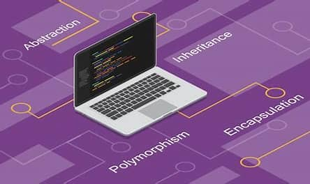
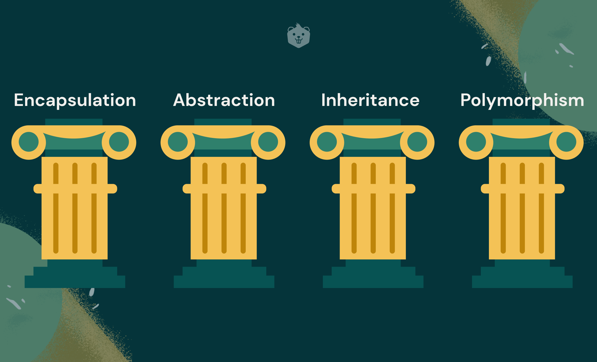

# OOPS and Generic Programming
This branch in the repository specifically contains the missions focused on the Object-Oriented Programming Styles and Generic Programming concepts. 

__See me on LinkedIn__ : [Link to my LinkedIn ID](https://www.linkedin.com/in/khajanbhatt/)

## Topics Covered:
  - POPS vs OOPS
  - Classes and Objects
  - Access Specifiers : public, private and protected
  - __Encapsulation - 1st Pillar of OOPS__
  - Constructors and Destructors, Move Sementics
  - Static Data Members and Static Data Functiosn
  - Friend Functions, Classes and Member Functions
  - __Inheritance - 2nd Pillar of OOPS__
      - Single Inheritance
      - Multiple Inheritance
      - Hierarchical Inheritance
      - Multi-level Inheritance
      - Hybrid Inheritance
      - Ambiguity in Inheritance
      - Virtual Classes and 'Has-a' Relationship
      - Constructor Delegagy
      - Diamond Problem
  - Nested Classes vs Inheritance
  - this Pointer and Object Chaining
  - explicit Keyword
  - const Objects and mutable keyword
  - **Polymorphism - 3rd Pillar of OOPS**
      - Function Overloading
      - Function Hiding
      - Operator Overloading:
          - Member Functions
          - Friend Functions
          - Functors
      - Function Overriding
      - final specifier
      - Static and Dynamic Binding
  - **Abstraction - 4th Pillar of OOPS**
  - Polymorphic Collections
  - Upcasting and Downcasting
  - Generic Programming
      - Class Templates
      - Function Templates
      - Generic Lambdas

## Files in the Project
    Platform : Coursera
    Specialization: Object Oriented Programming
    Lecturer: Dr Matthew Yee-King, Lecturer, University of London